# 📌 Proyecto Final DWES (PHP + MVC)

Aplicación web desarrollada en **PHP con arquitectura MVC**, que permite gestionar entidades a través de un sistema de roles con autenticación.  
Incluye **CRUD completo**, gestión de usuarios, sesiones y validación de formularios.  

---

## 🚀 Demo  

Este proyecto está pensado para correr en **local con XAMPP**.  
👉 No tiene despliegue online por el momento.  

---

## 🛠️ Tecnologías utilizadas  

  
  
  
  
  

---

## ⚙️ Funcionalidades  

- ✅ Arquitectura MVC (Modelo - Vista - Controlador)  
- ✅ Programación Orientada a Objetos (POO)  
- ✅ CRUD sobre base de datos MySQL  
- ✅ Gestión de usuarios con roles y autenticación  
- ✅ Sesiones de usuario  
- ✅ Validación de formularios  
- ✅ Diseño responsive básico  

---
## 📂 Tour por la Aplicación

### 🌍 Vistas Públicas (Sin Registro)
Secciones accesibles para cualquier visitante.

* **Página de Inicio (Index):** Presentación principal de la plataforma.
    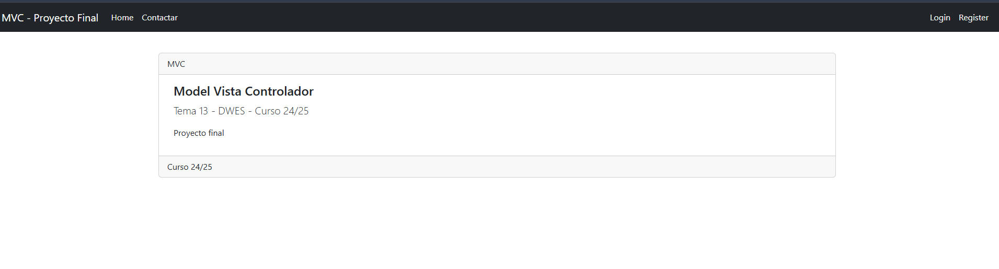
* **Contacto:** Formulario funcional para consultas externas.
    
* **Acceso y Registro:** Formularios de Login y alta de nuevos usuarios.
   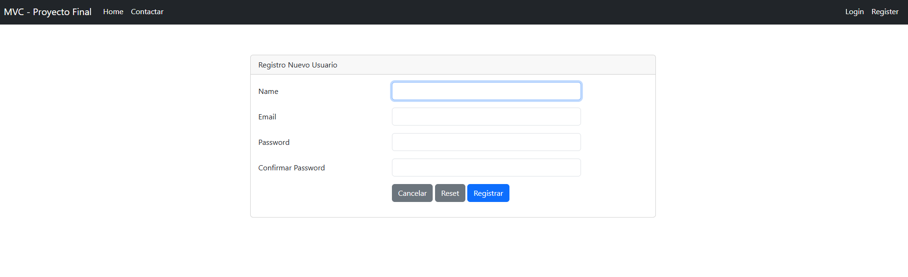
    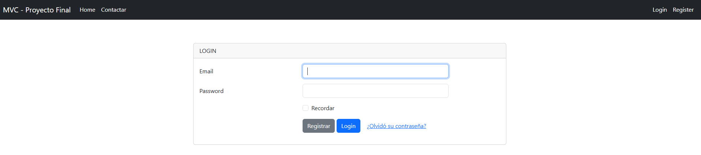   
* **Validación y Errores:** Sistema de alertas para notificar errores en formularios o accesos denegados.
    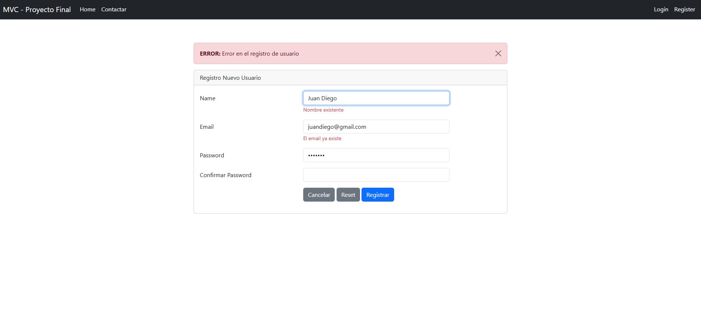
    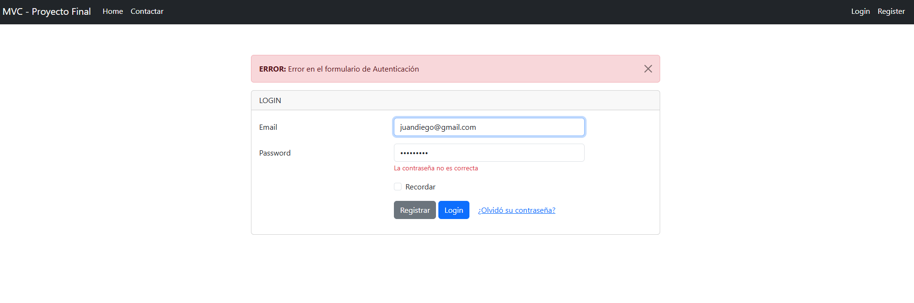

### 👤 Experiencia del Usuario Registrado
Funcionalidades tras el inicio de sesión.

* **Catálogo de Libros y Autores:** Acceso a la base de datos de la biblioteca.
    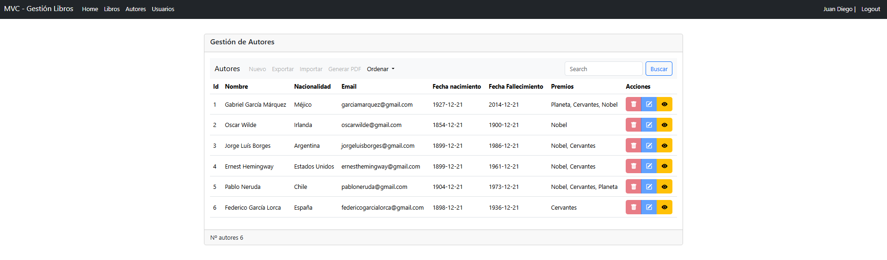
* **Ordenación Dinámica:** Capacidad de organizar listas (ej. por precio o título).
    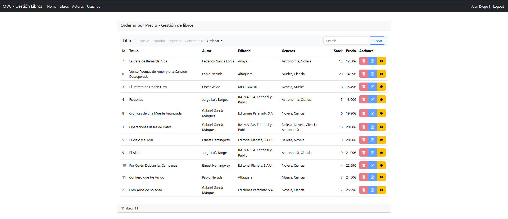
* **Gestión de Perfil:** Cada usuario puede actualizar su propia información personal.
    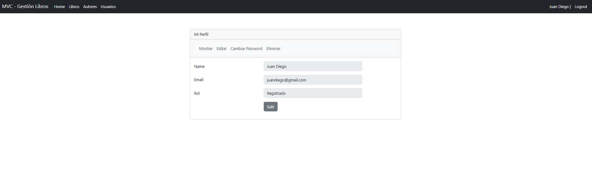

---

## 👥 Niveles de Acceso y Roles

El sistema utiliza **Control de Acceso Basado en Roles (RBAC)** para proteger las rutas y acciones:

### 👑 Rol: Administrador
Es el perfil con control total sobre la plataforma. Sus funciones principales incluyen:

* **Gestión de Usuarios:**
    * Crear nuevos usuarios: 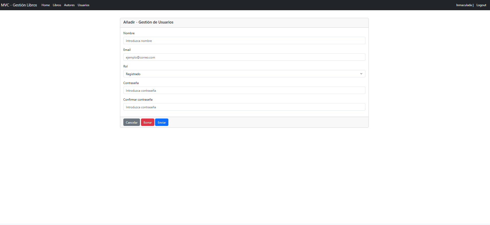
    * Borrado de cuentas: 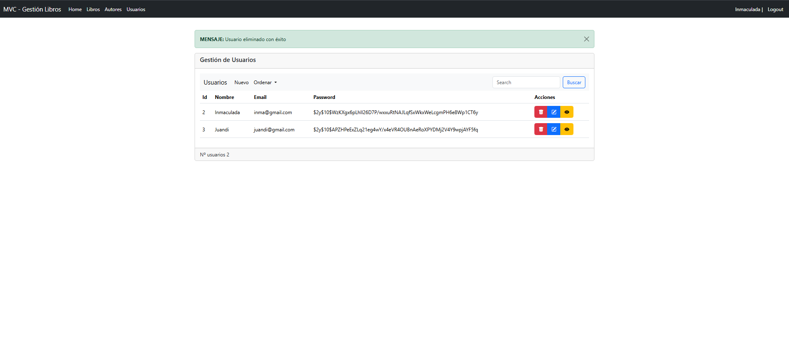
* **Mantenimiento del Catálogo:** CRUD completo de libros y autores.
    *  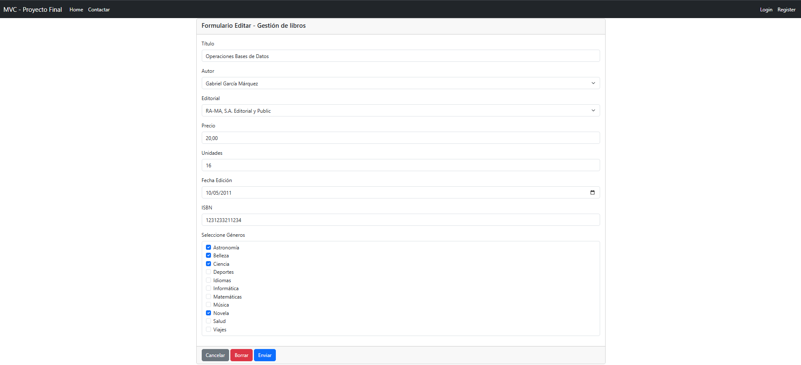
    * 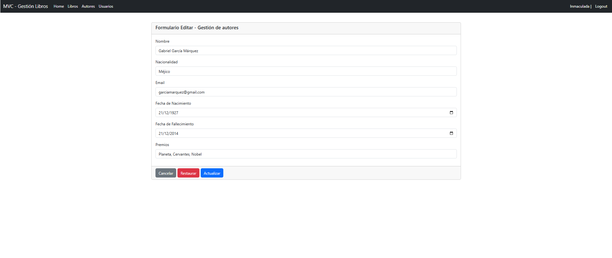
* **Herramientas de Datos (Import/Export):**
    * 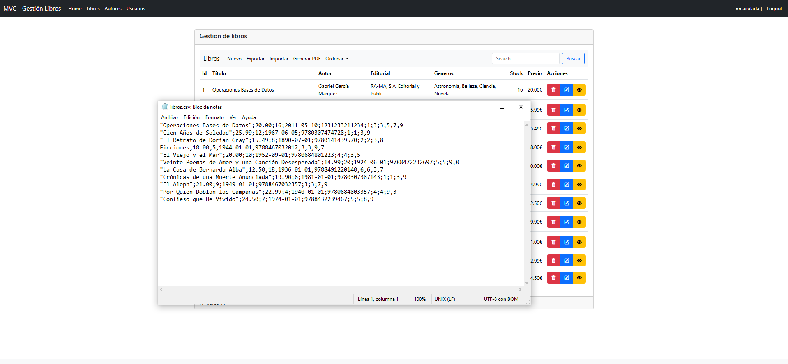 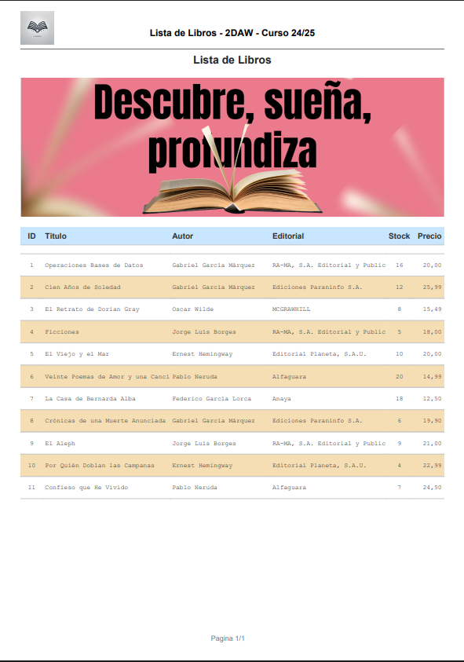
    * 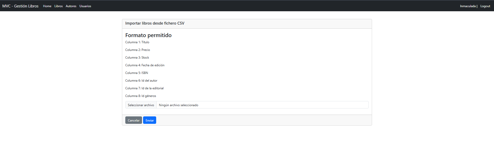

### 📝 Rol: Editor
- **Capacidades:** Gestión de contenido (Libros, Autores, Editoriales). No puede eliminar ni gestionar usuarios.
- **Captura:** 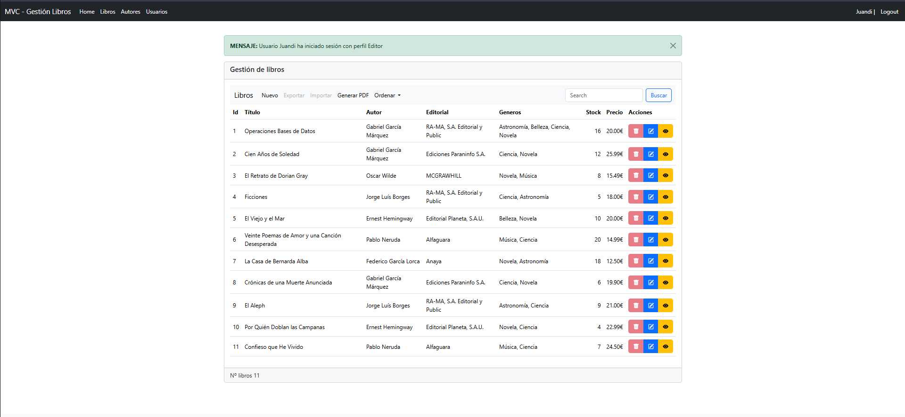

### 👤 Rol: Registrado
- **Capacidades:** Visualización de catálogo. Interfaz sin botones de edición o borrado.
- **Captura:** 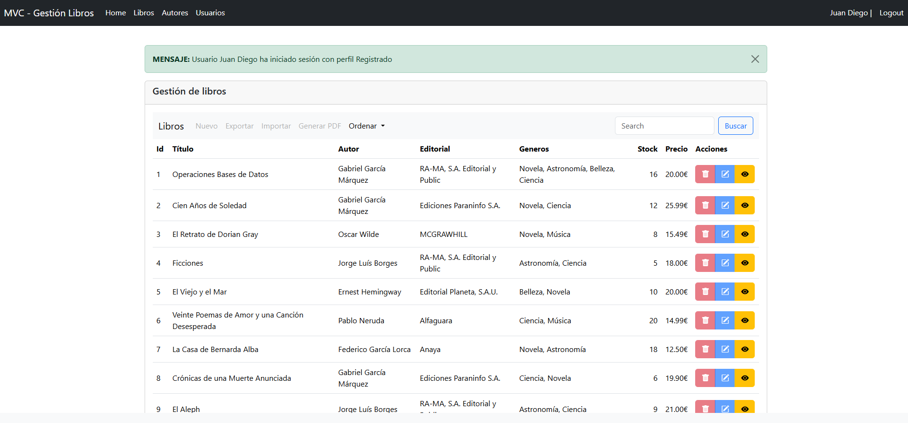

---

## 📦 Instalación y ejecución en local  

### 1️⃣ Requisitos previos  
- Tener instalado **XAMPP** (incluye Apache + MySQL).  
- Tener el servicio de **Apache** y **MySQL** corriendo.  

### 2️⃣ Clonar el proyecto  
Clona este repositorio dentro de la carpeta `htdocs` de tu instalación de XAMPP:  
```bash
git clone https://github.com/jotade9/dews_2425.git
```

### 3️⃣ Configurar la Base de Datos

El script para crear la base de datos, sus tablas y los datos iniciales se encuentra en la carpeta `bd/`.

#### Método recomendado: Importar desde MySQL Workbench

1.  Abre **MySQL Workbench** y conéctate a tu servidor local.
2.  En el menú superior, ve a `Server` > `Data Import`.
3.  Selecciona la opción `Import from Self-Contained File`.
4.  Busca y selecciona el archivo `.sql` que se encuentra dentro de la carpeta `bd/` del proyecto.
5.  En `Default Target Schema`, haz clic en `New...` para crear una nueva base de datos. Dale un nombre (por ejemplo, `proyecto_dwes`).
6.  Haz clic en **Start Import** para ejecutar el script. Al finalizar, tendrás la base de datos lista.

#### Método alternativo: Copiar y ejecutar el script

1.  Abre el archivo `.sql` de la carpeta `bd/` con un editor como **Visual Studio Code**.
2.  Selecciona todo el contenido (`Ctrl+A` o `Cmd+A`) y cópialo (`Ctrl+C` o `Cmd+C`).
3.  En **MySQL Workbench**, crea una nueva base de datos desde el panel izquierdo (clic derecho > `Create Schema...`).
4.  Abre una nueva pestaña de script (`SQL Query Tab`) para esa base de datos.
5.  Pega el contenido del archivo y ejecuta el script completo (haz clic en el icono del rayo ⚡).

---

### 4️⃣ ¡Ejecutar el proyecto!

Una vez clonado el repositorio y configurada la base de datos, abre tu navegador web y accede a:

http://localhost/dews_2425/

*(Reemplaza `dews_2425` por el nombre de la carpeta del proyecto si lo has cambiado).*


